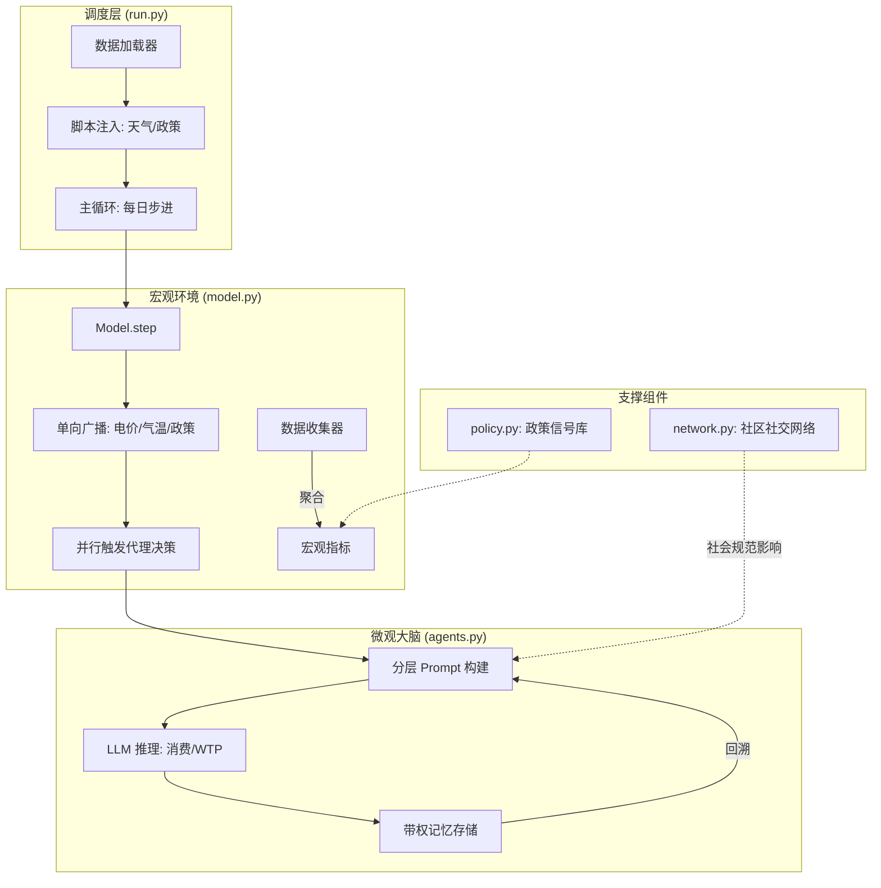
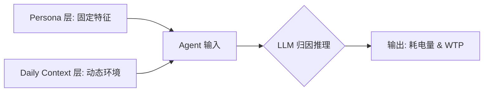

# 能源转型 ABM 仿真系统：功能逻辑与架构指南

本指南旨在深入解析“能源转型大模型 Agent 仿真系统”的设计架构、逻辑拆解以及核心技术实现，为论文研究展示提供直观的代码层级说明。

---

## 1. 系统全景架构 (System Panorama)

本系统采用 **宏观能源模型 (EBM)** 与 **微观代理模型 (ABM)** 耦合的混合架构。

---

## 2. 核心组件功能拆解

### 2.1 `run.py`：工作流调度中心
- **职责**：整个系统的单一启动入口。
- **逻辑流程**：
    1.  **数据初始化**：加载问卷 CSV，转换为 Python 字典，不与 `model.py` 耦合路径。
    2.  **剧本管理**：配置“天气脚本”与“政策脚本”，驱动时间轴推演。
    3.  **IO 汇总**：模拟结束后将 `Model` 收集到的多维指标导出至 `results/` 目录。

### 2.2 `model.py`：环境模拟引擎（造物主）
- **职责**：管理全局时间线与资源分配，感知社交拓扑。
- **核心机制**：
    -   **广播机制**：每步将当天的 `current_price` 和 `current_policy` 注入环境。
    -   **聚合逻辑**：在所有 Agent 完成 `step` 后，实时计算当天的 `Total_Consumption` 与 `Avg_WTP`。

### 2.3 `agents.py`：异质性 Agent 大脑
- **职责**：模拟具备认知偏差与历史记忆的复杂家庭个体。
- **设计亮点**：
    -   **异质性属性**：位置、收入、家电保有量、环保意识、价格敏感度五大维度。
    -   **容错处理**：若 LLM API 调用失败，自动回退（Fallback）至基于专家经验的“规则树”决策模型。

---

## 3. LLM Agent 深度决策逻辑

系统通过以下三个维度模拟 Agent 的复杂决策过程：

### 3.1 分层提示词 (Hierarchical Prompting)

- **Persona**：固定的人设（如：长三角中等收入、高价格敏感度）。
- **Context**：当天的气温、电价、邻居干了什么、国家颁布了什么政策。

### 3.2 记忆系统：重要性评分与加权检索(可调)
Agent 不会平等对待所有历史。
- **评分权重**：气温极端性 (40%) + 电价偏离 (30%) + 政策强度 (30%)。
- **检索逻辑**：$综合评分 = 0.6 \times 重要性 + 0.4 \times 近期度$。确保 Agent 在酷暑天能想起去年的极寒经历。

---

## 4. 数据处理与流动 (Data Pipeline)

| 阶段 | 处理内容 | 对应物理文件 |
| :--- | :--- | :--- |
| **输入 (Input)** | 原始问卷清洗 -> 户主特征抽样 -> 环境脚本生成 | `data/*.csv`, `run.py` |
| **处理 (Processing)** | LLM 异步并发推理 -> 社交压力注入 -> 记忆库持续更新 | `agents.py`, `network.py` |
| **输出 (Output)** | 宏观 (Model Vars) + 微观 (Agent Vars) 双重轨迹 | `results/*.csv` |

---

## 5. 项目功能与论文研究目标的对应映射

| 论文研究目标 (Research Objective) | 代码层实现 (Implementation) | 验证价值 |
| :--- | :--- | :--- |
| **O1: 验证多维异质性对决策的影响** | `agents.py` 中的异质性属性定义与分类提示词。 | 证明收入与地区分布是非线性的。 |
| **O2: 探究社会规范的传播效应** | `network.py` 的 WS 小世界网络与邻居历史感知。 | 观察“邻里节电压力”如何导致集体行为转型。 |
| **O3: 分析政策干预的即时与长效敏感度** | `policy.py` 信号注入 + 带有“重要性”评分的记忆系统。 | 验证“一次性政策冲击”是否能形成长期绿色意识沉淀。 |

---

## 6. 技术选型说明
- **ABM 框架**：Mesa (Python)。
- **网络拓扑**：NetworkX (Watts-Strogatz 小世界模型)。
- **决策引擎**：OpenAI/Gemini API (异步调用)。
- **数据分析**：Pandas & DataCollector 系统备份。
